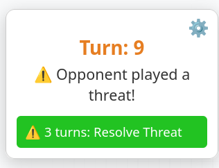
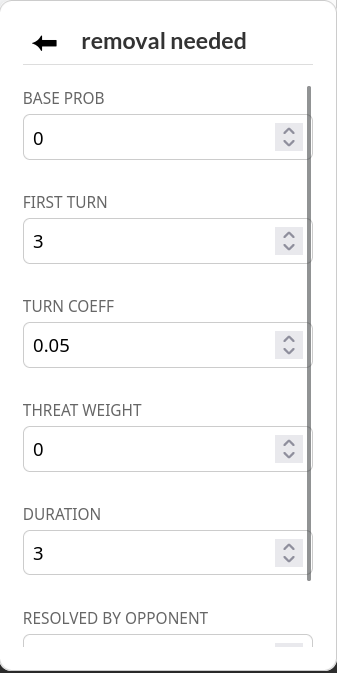

# Archidekt Goldfish Helper

**Archidekt Goldfish Helper** is a buddy for your solo playtesting sessions on [Archidekt](https://archidekt.com). This extension simulates "Virtual Opponents" that interact with your board based on random variables and turn-based scaling.

## 🌟 Simulated Events
* **Removal needed:** An opponent plays a threat that you must remove.
* **Boardwipe needed:** An opponent builds a massive board that requires a wipe.
* **Your threat removed:** One of your best permanents is destroyed or exiled.
* **Boardwipe:** A global effect clears all creatures from the battlefield.
* **Graveyard Exile:** Your graveyard is exiled.

  

## 🛠 Installation
1. **Download / Clone** this repository to your computer.
2. **Open your browser's extensions page**:
   - **Firefox**: Type `about:debugging#/runtime/this-firefox` -> Click "Load Temporary Add-on".
   - **Chrome**: Type `chrome://extensions` -> Enable "Developer Mode" -> Click "Load unpacked".
3. **Select the `manifest.json` file / the root folder**.
4. **Open an Archidekt playtester session** and start your game!

**N.B.:** You may need to fully refresh the page in the player for the extension to display properly (Ctrl+Shift+R).

## ⚙️ How to Customize
Click the **Gear Icon (⚙️)** on the floating widget to open the settings:
1. **Toggle Events**: Turn specific interactions on or off depending on the "meta" you want to test against.
2. **Adjust Parameters**: Click any event name to change its "First Turn" (when it starts being possible) or its "Growth Rate."
3. **Reset**: Use the **Reset All** button to immediately revert to the factory default parameters.

  

## 📈 The Math
The chance of an event happening is calculated every turn as:
`Probability = Base Chance + (Current Turn - Start Turn) * Growth Rate + Threat Weight`

* **Threat Weight:** This is a dynamic modifier. For example, the more creatures you control, the higher the "Threat Weight" becomes for a Board Wipe event!

## 🤝 Contributing
Feel free to suggest any modifications, new event ideas, or report any bugs you find during your sessions.

## ⚖️ License
Creative Commons Attribution-NonCommercial 4.0 International